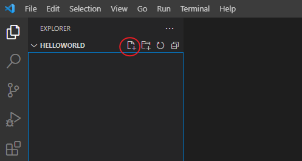
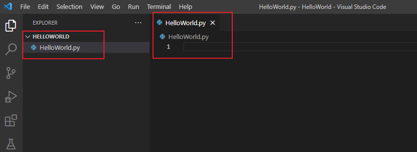
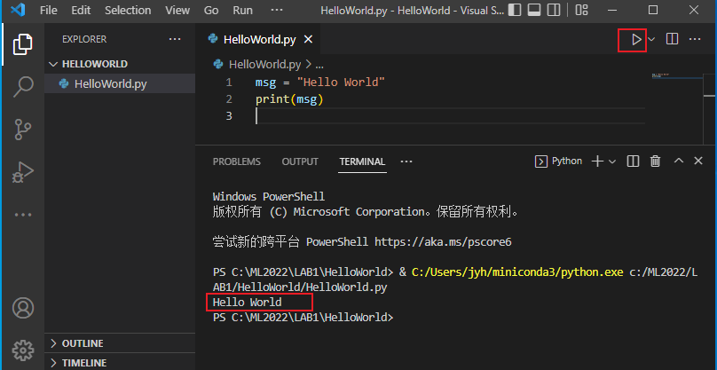
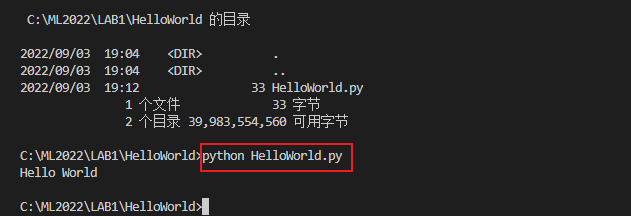
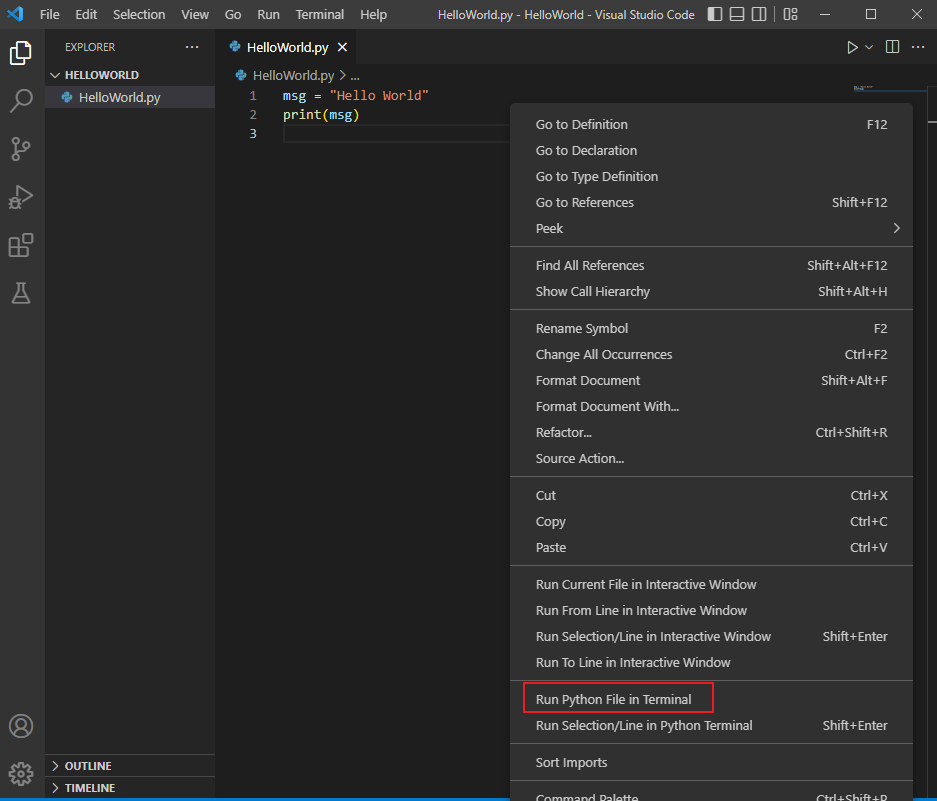
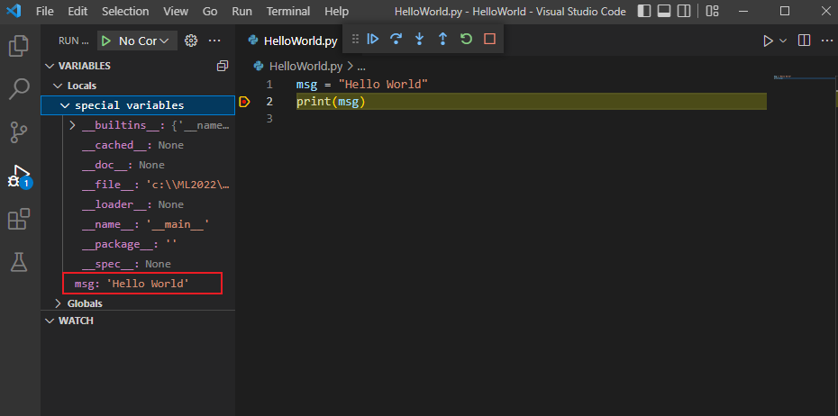

# Getting Started with Python in VS Code

In this tutorial, you use Python 3 to create the simplest Python "Hello World" application in Visual Studio Code.  By using the Python extension, you make VS Code into a great lightweight Python IDE.

This tutorial introduces you to VS Code as a Python environment, primarily how to edit, run, and debug code through the following tasks:

- Write, run, and debug a Python "Hello World" Application
- Learn how to install packages by creating Python virtual environments
- Write a simple Python script to plot figures within VS Code

This tutorial is not intended to teach you Python itself.

## Prerequisites

To successfully complete this tutorial, you need to first setup your Python development environment. Specifically, this tutorial requires:

- VS Code
- VS Code Python extension
- Python 3

## Install Visual Studio Code and the Python Extension

### Install Studio Code

#### **Install Visual Studio Code on windows**

[Visual Studio Code](https://code.visualstudio.com/) is a powerful open-source code editor developed by Microsoft. It has built-in debugging support, embedded [Git](https://linuxize.com/post/how-to-install-git-on-ubuntu-18-04/) control, syntax highlighting, code completion, integrated terminal, code refactoring, and snippets. Visual Studio Code is cross-platform, available on Windows, Linux, and macOS.

In this section, we’ll discuss how to download and install the VS Code on Windows.

**Step 1**: First of all, we need to download the installer file for Windows operating system. For that visit [https://code.visualstudio.com/Download](https://code.visualstudio.com/Download) and download the windows version of Visual Studio Code

> **Note**:- Visual Studio Code is also available for other operating systems like MacOS and Linux (Ubuntu, Debian, Red Hate, Fedora).


**Step 2**: After you have downloaded the installer file open it and *accept the licence agreement* then click on “*Next*“.


**Step 3**: Now select your installation location, where you want to install Visual Studio Code. If you don’t have any good reason to change the installation location then keep it to default.


**Step 4**: After that select Start Menu Folder and add some additional tasks, “*create a desktop icon*” and “*Add to Path*“.

> **Note:**– It is very important to add Visual Studio Code to PATH.


**Step 5**: Finally you are ready to install the VS Code on Windows 10. Just review all your selections then click on “Install”.


It will take some time to install so wait until the installation completed. After that, you’re ready to use to Visual Studio Code.

**Step 6**: After it is completed, click the "Finish" button.


**Step 7**: If we left the "*Launch Visual Studio Code*" checkbox selected, the VS Code will run and will look something like this.


As shown above, we can open or create new files in VS Code, as well as open folders and clone Git repositories.

#### **Install Visual Studio Code on macos**

Follow the below steps*(shown in gif file and mentioned in bullet points)* to install the VS Code on macOS:

1. Download Visual Studio Code for macOS.

   
2. After clicking on the Mac option on the download site, it will download a zip file .
3. **Double-click** on the downloaded zip to expand the contents. It will give a file, as shown below:
4. *Drag **"Visual Studio Code.app"** to the **"Applications"** folder, so as it available in the **"Launchpad."***
5. *Double click on the **"Visual Studio Code"** to open.*
6. *Add VS Code to your Dock by right-clicking on the icon to bring up the context menu and choosing **Options => Keep in Dock.***


#### **Install Visual Studio Code on ubuntu**

**Step 1**: Download Visual Studio Code for ubuntu.


**Step 2**:  After clicking on the `.deb` option on the download site, it will download a `.deb` file .


**Step 3**: Go to the directory where the `code_1.66.0-1648620611_amd64.deb` is located, open the **terminal** and type the following command to kickstart the installation process.

```shell
sudo dpkg -i code_1.66.0-1648620611_amd64.deb
```

**The installation process is as follows :**

```shell
root@jyh:~/vscode# sudo dpkg -i code_1.66.0-1648620611_amd64.deb 
正在选中未选择的软件包 code。
(正在读取数据库 ... 系统当前共安装有 129927 个文件和目录。)
正准备解包 code_1.66.0-1648620611_amd64.deb  ...
正在解包 code (1.66.0-1648620611) ...
正在设置 code (1.66.0-1648620611) ...
正在处理用于 gnome-menus (3.13.3-11ubuntu1.1) 的触发器 ...
正在处理用于 desktop-file-utils (0.23-1ubuntu3.18.04.2) 的触发器 ...
正在处理用于 mime-support (3.60ubuntu1) 的触发器 ...
正在处理用于 shared-mime-info (1.9-2) 的触发器 ...
root@jyhs:~/vscode# 
1234567891011
```

**Step 4**: Now that VS Code is installed on your Ubuntu system you can launch it either from the command line by typing `code` or by clicking on the VS Code icon (`Activities -> Visual Studio Code`).


When you start VS Code for the first time, a window like the following should appear:


### Python Extension for VS Code

To install extensions from within Visual Studio Code:

1. Click on **Extensions** icon , search the extension you want to install. (If you know the name or part of the name of the extension, you can search in the **Search** window.)
2. Select the extension, review its Details, contributions, changelog and more.
3. Finally when you’re ready to install the extension click on the “**Install **”button.


**After installation complete reopen the Visual Studio Code.**

## Install a Python interpreter

Along with the Python extension, you need to install a Python interpreter. Which interpreter you use is dependent on your specific needs, but some guidance is provided below.

### Windows

Install [Python from python.org](https://www.python.org/downloads/). You can typically use the **Download Python** button that appears first on the page to download the latest version.

> **Note**: If you don't have admin access, an additional option for installing Python on Windows is to use the Microsoft Store. The Microsoft Store provides installs of [Python 3.7](https://www.microsoft.com/p/python-37/9nj46sx7x90p), [Python 3.8](https://www.microsoft.com/p/python-38/9mssztt1n39l), [Python 3.9](https://www.microsoft.com/p/python-39/9p7qfqmjrfp7), and [Python 3.10](https://www.microsoft.com/p/python-310/9pjpw5ldxlz5). Be aware that you might have compatibility issues with some packages using this method.

For additional information about using Python on Windows, see [Using Python on Windows at Python.org](https://docs.python.org/3.7/using/windows.html)

#### 1. Download Python on Windows 10

1. Click on the following link to download the Python for Windows [Download Python for Windows 10](https://www.python.org/downloads/windows/), and you can select any one of the following, as shown in the below image. I chose the Windows `Python3.9.13` executable installer for the installation.


#### 2. Install Python 3.9 on Windows 10

1. After completing the download, run the executable to start the installation for Python 3.7 on Windows 10. The first installation screen will display as shown in the below image. Select the check-boxes for install launcher for all users and Add Python 3.7 to PATH and click on the **Customize installation** option.


1. The installation customization screen will appear, as shown in below image. You can select all options and then Click on the Next button.


1. Specify the location of installation for Python, and select the check-boxes as per your need. Then click on the Install button.


1. The installation will be complete, and it will show the successful installation screen, as shown in the below image.


### macOS

The system install of Python on macOS is not supported. Instead, an installation through [Homebrew](https://brew.sh/) is recommended. To install Python using Homebrew on macOS use `brew install python3` at the Terminal prompt.

> **Note** On macOS, make sure the location of your VS Code installation is included in your PATH environment variable. See [these setup instructions](https://code.visualstudio.com/docs/setup/mac#_launching-from-the-command-line) for more information.

### Linux

The built-in Python 3 installation on Linux works well, but to install other Python packages you must install `pip` with [get-pip.py](https://pip.pypa.io/en/stable/installing/#installing-with-get-pip-py).

### Other options

 If your primary purpose for using Python is Data Science, then you might consider a download from [Anaconda](https://www.anaconda.com/download/). Anaconda provides not just a Python interpreter, but many useful libraries and tools for data science.

If you do not have the extra time and disk space required to install the more than 720 packages on the Anaconda distribution (Note that you will not need most of the packages), you can choose to [install Miniconda](Install Miniconda on Win10.md).


## Verify the Python installation

To verify that you've installed Python successfully on your machine, run one of the following commands (depending on your operating system):

- Linux/macOS: open a Terminal Window and type the following command:

  ```
  python3 --version
  ```
- Windows: open a command prompt and run the following command:

  ```
  py -3 --version
  ```

If the installation was successful, the output window should show the version of Python that you installed.

> **Note** You can use the `py -0` command in the VS Code integrated terminal to view the versions of python installed on your machine. The default interpreter is identified by an asterisk (*).

## Start VS Code in a project (workspace) folder

Create an empty folder called "HelloWorld".


Open VS Code (`code`)  and use **File > Open Folder** to open the project folder.


## Select a Python interpreter

Python is an interpreted language, and in order to run Python code and get Python IntelliSense, you must tell VS Code which interpreter to use.

From within VS Code, select a Python 3 interpreter by opening the **Command Palette** (Ctrl+Shift+P), start typing the **Python: Select Interpreter** command to search, then select the command. You can also use the **Select Python Environment** option on the Status Bar if available (it may already show a selected interpreter, too):


The command presents ay list of available interpreters that VS Code can find automatically, including virtual environments. If you don't see the desired interpreter, see [Configuring Python environments](https://code.visualstudio.com/docs/python/environments).

> **Note**: When using an Anaconda distribution, the correct interpreter should have the suffix `('base':conda)`, for example `Python 3.7.3 64-bit ('base':conda)`.

Selecting an interpreter sets which interpreter will be used by the Python extension for that workspace.

> **Note**: If you select an interpreter without a workspace folder open, VS Code sets `python.defaultInterpreterPath` in User scope instead, which sets the default interpreter for VS Code in general. The user setting makes sure you always have a default interpreter for Python projects. The workspace settings lets you override the user setting.

## Create a Python Hello World source code file

From the File Explorer toolbar, select the **New File** button on the `hello` folder:



Name the file `HelloWorld.py`, and it automatically opens in the editor:



By using the `.py` file extension, you tell VS Code to interpret this file as a Python program, so that it evaluates the contents with the Python extension and the selected interpreter.

> **Note**: The File Explorer toolbar also allows you to create folders within your workspace to better organize your code. You can use the **New folder** button to quickly create a folder.

Now that you have a code file in your Workspace, enter the following source code in `hello.py`:

```
msg = "Hello World"
print(msg)
```

When you start typing `print`, notice how `IntelliSense` presents auto-completion options.


IntelliSense and auto-completions work for standard Python modules as well as other packages you've installed into the environment of the selected Python interpreter. It also provides completions for methods available on object types. For example, because the `msg` variable contains a string, IntelliSense provides string methods when you type `msg.`:


Feel free to experiment with IntelliSense some more, but then revert your changes so you have only the `msg` variable and the `print` call, and save the file (Ctrl+S).

For full details on editing, formatting, and refactoring, see [Editing code](https://code.visualstudio.com/docs/python/editing). The Python extension also has full support for Linting.

## Run Hello World

It's simple to run `HelloWorld.py` with Python. Just click the **Run Python File in Terminal** play button in the top-right side of the editor.



The button opens a terminal panel in which your Python interpreter is automatically activated, then runs `python3 HelloWorld.py` (macOS/Linux) or `python Helloword.py` (Windows):



There are three other ways you can run Python code within VS Code:

- Right-click anywhere in the editor window and select **Run Python File in Terminal** (which saves the file automatically):

  

## Configure and run the debugger

Let's now try debugging our simple Hello World program.

First, set a breakpoint on line 2 of `hello.py` by placing the cursor on the `print` call and pressing F9. Alternately, just click in the editor's left gutter, next to the line numbers. When you set a breakpoint, a red circle appears in the gutter.


Next, to initialize the debugger, press **F5**. Since this is your first time debugging this file, a configuration menu will open from the Command Palette allowing you to select the type of debug configuration you would like for the opened file.


**Note**: VS Code uses JSON files for all of its various configurations; `launch.json` is the standard name for a file containing debugging configurations.

These different configurations are fully explained in [Debugging configurations](https://code.visualstudio.com/docs/python/debugging); for now, just select **Python File**, which is the configuration that runs the current file shown in the editor using the currently selected Python interpreter.

The debugger will stop at the first line of the file breakpoint. The current line is indicated with a yellow arrow in the left margin. If you examine the **Local** variables window at this point, you will see now defined `msg` variable appears in the **Local** pane.



A debug toolbar appears along the top with the following commands from left to right: continue (F5), step over (F10), step into (F11), step out (Shift+F11), restart (Ctrl+Shift+F5), and stop (Shift+F5).


The Status Bar also changes color (orange in many themes) to indicate that you're in debug mode. The **Python Debug Console** also appears automatically in the lower right panel to show the commands being run, along with the program output.

To continue running the program, select the continue command on the debug toolbar (F5). The debugger runs the program to the end.

> **Tip** Debugging information can also be seen by hovering over code, such as variables. In the case of `msg`, hovering over the variable will display the string `Hello world` in a box above the variable.

You can also work with variables in the **Debug Console** (If you don't see it, select **Debug Console** in the lower right area of VS Code, or select it from the **...** menu.) Then try entering the following lines, one by one, at the **>** prompt at the bottom of the console:

```
msg
msg.capitalize()
msg.split()
```


Select the blue **Continue** button on the toolbar again (or press F5) to run the program to completion. "Hello World" appears in the **Python Debug Console** if you switch back to it, and VS Code exits debugging mode once the program is complete.

If you restart the debugger, the debugger again stops on the first breakpoint.

To stop running a program before it's complete, use the red square stop button on the debug toolbar (Shift+F5), or use the **Run > Stop debugging** menu command.

For full details, see [Debugging configurations](https://code.visualstudio.com/docs/python/debugging), which includes notes on how to use a specific Python interpreter for debugging.

> **Tip: Use Logpoints instead of print statements**: Developers often litter source code with `print` statements to quickly inspect variables without necessarily stepping through each line of code in a debugger. In VS Code, you can instead use **Logpoints**. A Logpoint is like a breakpoint except that it logs a message to the console and doesn't stop the program. For more information, see [Logpoints](https://code.visualstudio.com/docs/editor/debugging#_logpoints) in the main VS Code debugging article.

## Install and use packages

Let's now run an example that's a little more interesting. In Python, packages are how you obtain any number of useful code libraries, typically from [PyPI](https://pypi.org/). For this example, you use the `matplotlib` and `numpy` packages to create a graphical plot as is commonly done with data science. (Note that `matplotlib` cannot show graphs when running in the [Windows Subsystem for Linux](https://docs.microsoft.com/windows/wsl/about) as it lacks the necessary UI support.)

Return to the **Explorer** view (the top-most icon on the left side, which shows files), create a new file called `standardplot.py`, and paste in the following source code:

```
import matplotlib.pyplot as plt
import numpy as np

x = np.linspace(0, 20, 100)  # Create a list of evenly-spaced numbers over the range
plt.plot(x, np.sin(x))       # Plot the sine of each x point
plt.show()                   # Display the plot
```

> **Tip**: If you enter the above code by hand, you may find that auto-completions change the names after the `as` keywords when you press Enter at the end of a line. To avoid this, type a space, then Enter.

Next, try running the file in the debugger using the "Python: Current file" configuration as described in the last section.


Unless you're using an Anaconda distribution or have previously installed the `matplotlib` package, you should see the message, **"ModuleNotFoundError: No module named 'matplotlib'"**. Such a message indicates that the required package isn't available in your system.

1. To install the `matplotlib` package (which also installs `numpy` as a dependency), stop the debugger and use the Command Palette to run **Terminal: Create New Terminal** (Ctrl+Shift+`). This command opens a command prompt for your selected interpreter.


2. Enter the following command on the terminal.

   ```
   pip install -i https://pypi.tuna.tsinghua.edu.cn/simple some-package
   ```

   

or

```
pip config set global.index-url https://pypi.tuna.tsinghua.edu.cn/simple #设置安装源
pip install some-package
```

3. Rerun the program now (with or without the debugger) and after a few moments a plot window appears with the output:


A best practice among Python developers is to avoid installing packages into a global interpreter environment. You instead use a project-specific `virtual environment` that contains a copy of a global interpreter. Once you activate that environment, any packages you then install are isolated from other environments. Such isolation reduces many complications that can arise from conflicting package versions.  `conda` is recommended for managing the environments.
